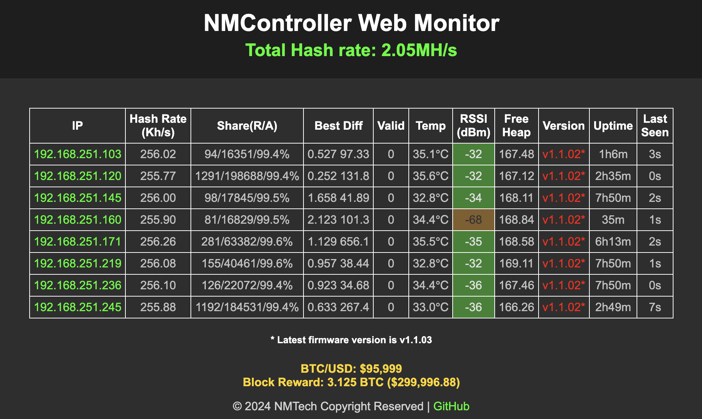

# NMController_web - Web Group Controller in your LAN

## Description
NMController is designed for the devices:

- [NMMiner](https://github.com/NMminer1024/NMMiner.git) version v0.3.01 or higher
- [NMAxe](https://github.com/NMminer1024/ESP-Miner-NMAxe.git) , which will coming soon.

The NMController will listen the UDP Broadcast in Port: 12345, any devices can be recognized on this channel according to the specified JSON format.

```json
{
    "IP": "192.168.1.101",
    "BoardType": "NMLotto",
    "HashRate": "113.13K",
    "Share": "1/138",
    "NetDiff": "89.47T",
    "PoolDiff": "0.001",
    "LastDiff": "0.001",
    "BestDiff": "4.021M",
    "Valid": 0,
    "Progress": 0.167,
    "Temp": 48.5,
    "RSSI": -62,
    "FreeHeap": 8203.9,
    "Uptime": "000d 01:23:46",
    "Version": "v0.3.01"
}
```

## Features

The NMController Web is developed based on python, the Flask Framework.

### Install

Be sure your system installed the python3, the develop version is Python 3.11.

Install the requirements.

`pip install -r requirements.txt`

*Note: If you just want a software installed on your computer, you can get the [NMController](https://github.com/NMminer1024/NMController) Windows Desktop Version.*

### Running

`python nmcontroller.py`

The Web NMController will run on your local ip, port 7877. Enter the "http://127.0.0.1:7877" in the browser to access.

The Web Controller runs like this:



The page will refresh every 5 seconds.

Currently, the monitor will display the following information:
 - IP
 - HashRate
 - Share info
 - Net difficulty
 - Last difficulty
 - Best difficulty
 - Valid number of blocks mined
 - Device temp (℃)
 - Wifi RSSI (dBm)
 - Device free heap (KB)
 - Uptime
 - Last seen/updated

## Contact
- Anything do not work as your expectation, just let us know.

| Email                   |  Telegram                       |
| :-----------------:     |  :-----------------:            |
|nmminer1024@gmail.com    |  https://t.me/NMMiner |

## Contributors

Thank you to everyone who has contributed to this project! Special thanks to:

- **dWiGhT** ([dwightmulcahy@gmail.com](mailto:dwightmulcahy@gmail.com)) - Thank you for your valuable contributions and continued support!